# Pizzería Don Piccolo — Sistema de gestión de pedidos y domicilios

Base de datos relacional desarrollada en **MySQL** para apoyar la gestión de clientes, pizzas, ingredientes, pedidos, repartidores, domicilios y pagos de la Pizzería Don Piccolo.

El sistema reemplaza el registro manual de pedidos por una estructura que permite consultar ventas, controlar el inventario de ingredientes, registrar entregas a domicilio y auditar cambios de precios.

## Contenido

- [Modelo de datos](#modelo-de-datos)
- [Tablas principales](#tablas-principales)
- [Funciones](#funciones)
- [Procedimiento almacenado](#procedimiento-almacenado)
- [Triggers](#triggers)
- [Consultas realizadas](#consultas-realizadas)
- [Vistas](#vistas)
- [Evidencias sugeridas](#evidencias-sugeridas)

## Modelo de datos

El modelo contiene diez tablas relacionadas. Las claves foráneas aseguran que cada pedido pertenezca a un cliente, cada detalle corresponda a una pizza válida y cada domicilio tenga un repartidor asignado.

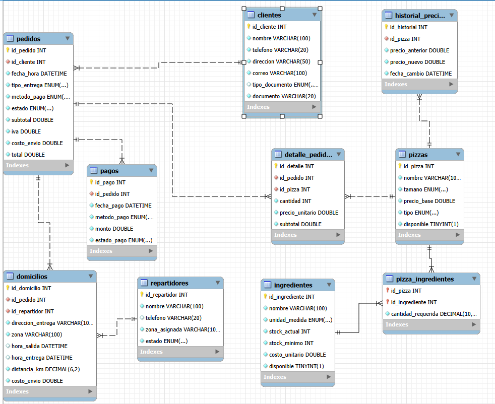

> El archivo `Diagrama_pizzeria.png` debe permanecer en la misma carpeta que este README para que GitHub o Visual Studio lo muestren correctamente.

## Tablas principales

| Tabla | Propósito |
|---|---|
| `clientes` | Almacena los datos personales y de contacto de los clientes. |
| `pizzas` | Contiene el menú: nombre, tamaño, precio, tipo y disponibilidad. |
| `ingredientes` | Controla existencias, stock mínimo, costo y disponibilidad de ingredientes. |
| `pizza_ingredientes` | Define la receta de cada pizza y la cantidad requerida de cada ingrediente. |
| `repartidores` | Registra repartidores, zona asignada y disponibilidad. |
| `pedidos` | Guarda la información general de cada venta. |
| `detalle_pedidos` | Relaciona los pedidos con las pizzas solicitadas. Un pedido puede tener varias pizzas. |
| `domicilios` | Registra el repartidor, las horas de salida y entrega, distancia y costo de envío. |
| `pagos` | Guarda el método, monto y estado del pago asociado a cada pedido. |
| `historial_precios` | Conserva los cambios de precio realizados sobre las pizzas. |

## Funciones

### 1. `calcular_total_pedido(id_pedido)`

Calcula el valor final de un pedido a partir de sus pizzas, el costo de envío y el IVA del 19% aplicado al subtotal de las pizzas.

```sql
SELECT calcular_total_pedido(1) AS total_pedido_1;
```

La función usa los valores almacenados en `detalle_pedidos`; de esta forma, un cambio posterior en el precio actual de una pizza no altera pedidos históricos.

### 2. `calcular_ganancia_neta_diaria(fecha)`

Calcula la ganancia neta de una fecha determinada:

```text
Ganancia neta = ventas de pedidos entregados − costo de ingredientes utilizados
```

```sql
SELECT calcular_ganancia_neta_diaria('2026-09-01') AS ganancia_neta;
```

## Procedimiento almacenado

### `registrar_entrega(id_domicilio, hora_entrega)`

Registra la hora de entrega de un domicilio y cambia automáticamente el estado del pedido relacionado a `entregado`.

```sql
CALL registrar_entrega(10, '2026-09-11 21:05:00');
```

Este procedimiento actualiza primero `domicilios.hora_entrega` y luego localiza el pedido asociado mediante `id_pedido`.

## Triggers

### Actualización automática de inventario

El trigger `actualizar_stock_ingredientes` se ejecuta después de insertar un registro en `detalle_pedidos`. Descuenta del stock la cantidad de ingredientes definida en la receta de la pizza.

Por ejemplo, si se piden dos Hawaianas familiares, se descuenta el doble de masa, salsa, queso, jamón, piña y orégano definidos para esa receta.

### Historial de precios

El trigger `registrar_historial_precio` se ejecuta cuando se actualiza `pizzas.precio_base`. Guarda en `historial_precios` el precio anterior, el precio nuevo y la fecha del cambio.

### Disponibilidad del repartidor

El trigger `liberar_repartidor` se activa cuando `domicilios.hora_entrega` cambia de `NULL` a una fecha válida. Entonces marca al repartidor asignado como `disponible`.

## Consultas realizadas

El proyecto incluye consultas para:

1. Clientes con pedidos entre dos fechas mediante `BETWEEN`.
2. Pizzas más vendidas mediante `GROUP BY`, `COUNT` y `SUM`.
3. Pedidos asignados por repartidor mediante `JOIN`.
4. Tiempo promedio de entrega por zona mediante `AVG` y `TIMESTAMPDIFF`.
5. Clientes que superan un monto de gasto mediante `HAVING`.
6. Búsqueda parcial de pizzas mediante `LIKE`.
7. Clientes frecuentes con más de cinco pedidos mensuales mediante una subconsulta.

## Vistas

| Vista | Información disponible |
|---|---|
| `vista_resumen_pedidos_cliente` | Cliente, cantidad de pedidos entregados y total gastado. |
| `vista_desempeno_repartidores` | Repartidor, zona, número de entregas y tiempo promedio de entrega. |
| `vista_stock_bajo_minimo` | Ingredientes cuyo stock actual está por debajo del mínimo permitido. |


### Función: total de pedido

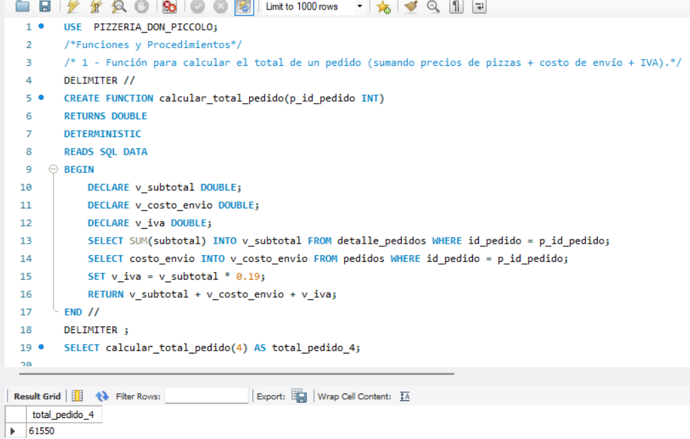

### Función: ganancia neta diaria

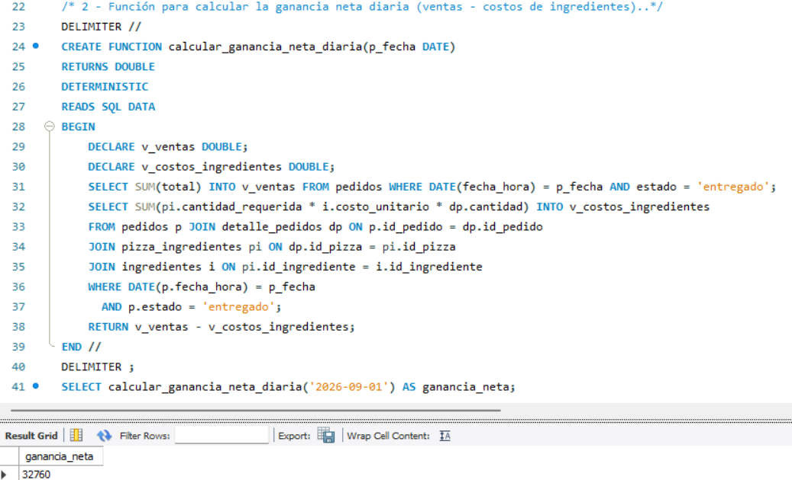

### Procedimiento: registrar entrega

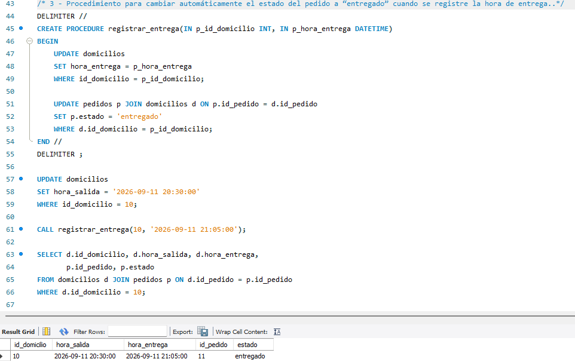

### Trigger: actualización de stock

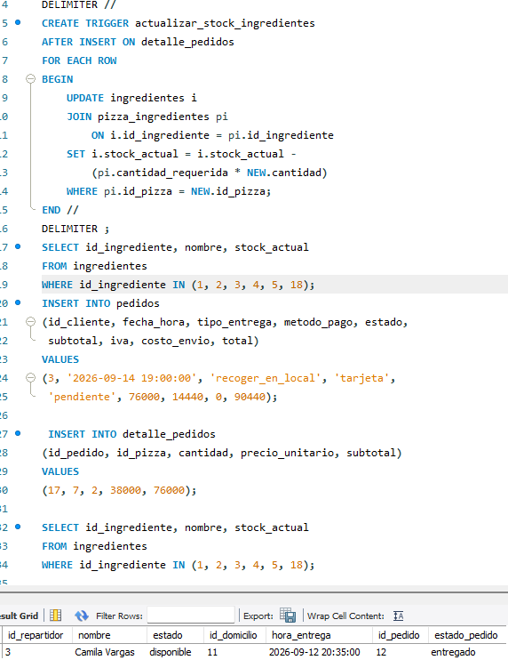

### Trigger: historial de precios

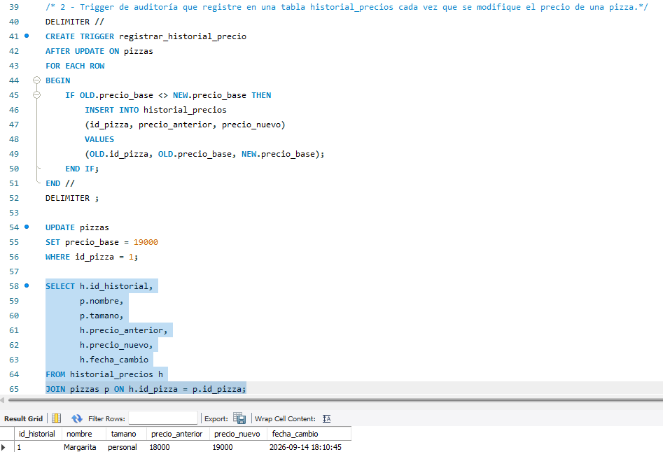

### Trigger: repartidor disponible

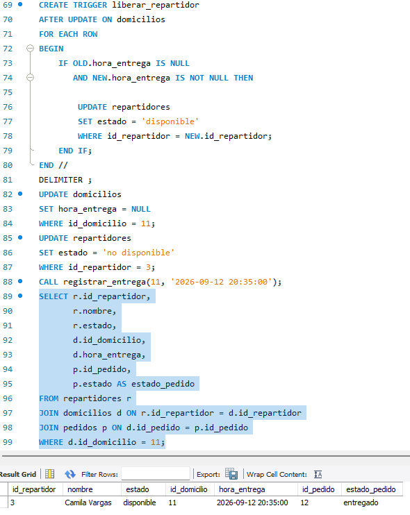

### Consultas y vistas

Guarda una captura individual para cada consulta y vista. Esto permite demostrar claramente el resultado de cada requerimiento.

#### Consulta 1: clientes con pedidos entre fechas

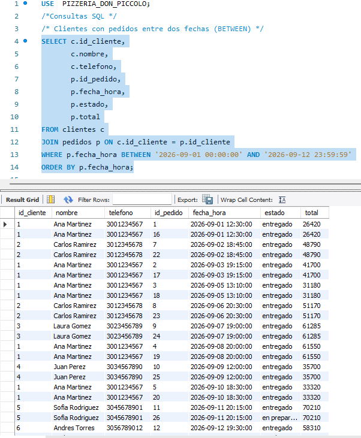

#### Consulta 2: pizzas más vendidas

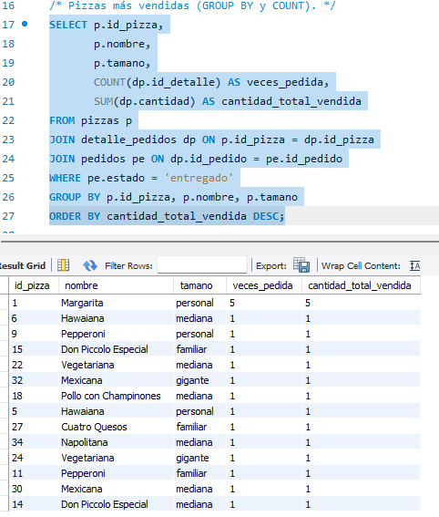

#### Consulta 3: pedidos por repartidor

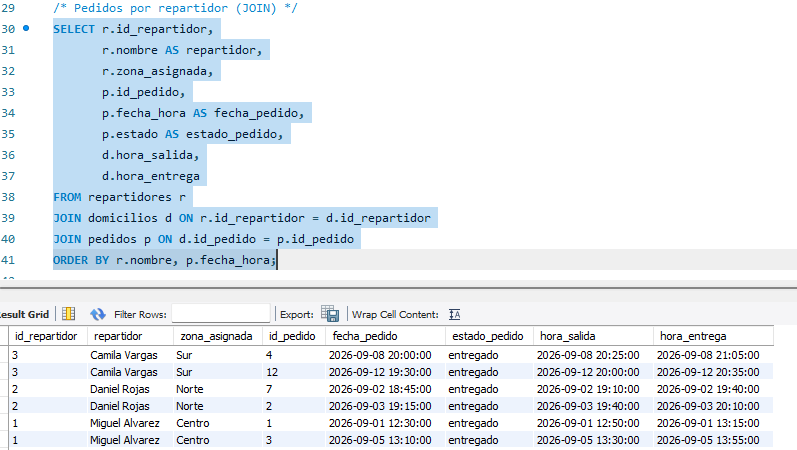

#### Consulta 4: promedio de entrega por zona

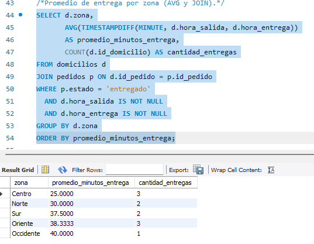

#### Consulta 5: clientes con gasto superior al monto

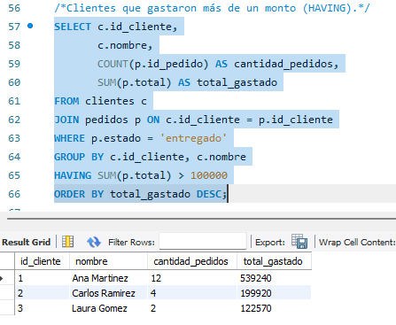

#### Consulta 6: búsqueda parcial de pizza

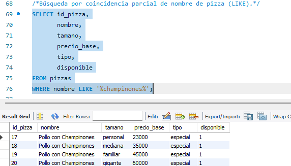

#### Consulta 7: clientes frecuentes

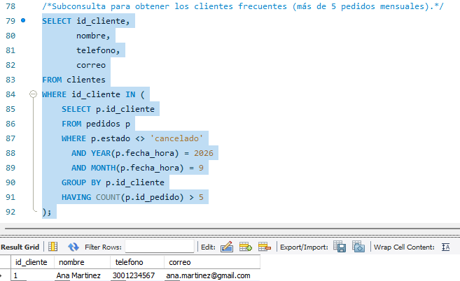

#### Vista 1: resumen de pedidos por cliente

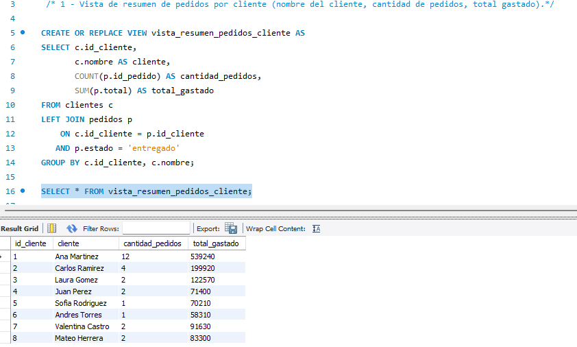

#### Vista 2: desempeño de repartidores

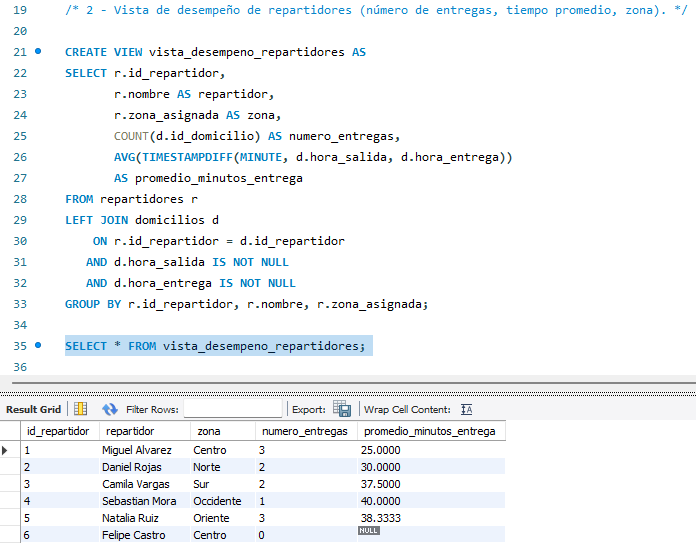

#### Vista 3: ingredientes bajo stock mínimo

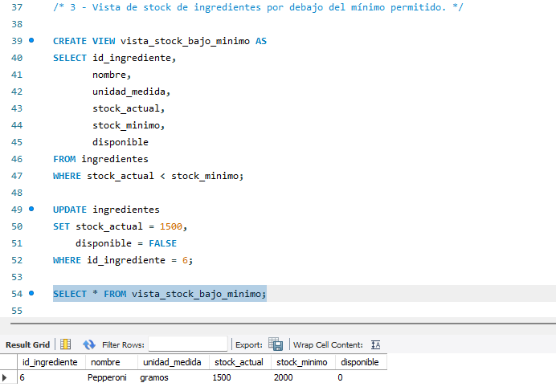

## Tecnologías utilizadas

- MySQL 8.0
- MySQL Workbench
- Visual Studio Code

---

Proyecto académico de base de datos para la gestión de pedidos y domicilios de Pizzería Don Piccolo.
